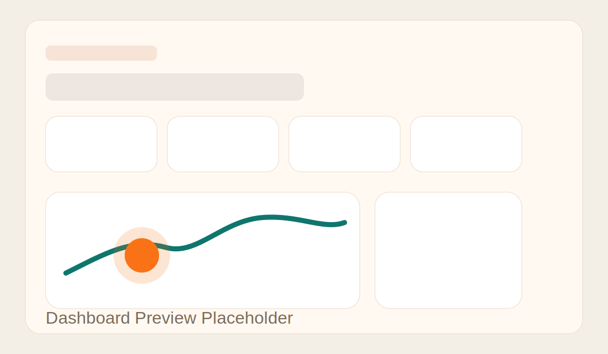
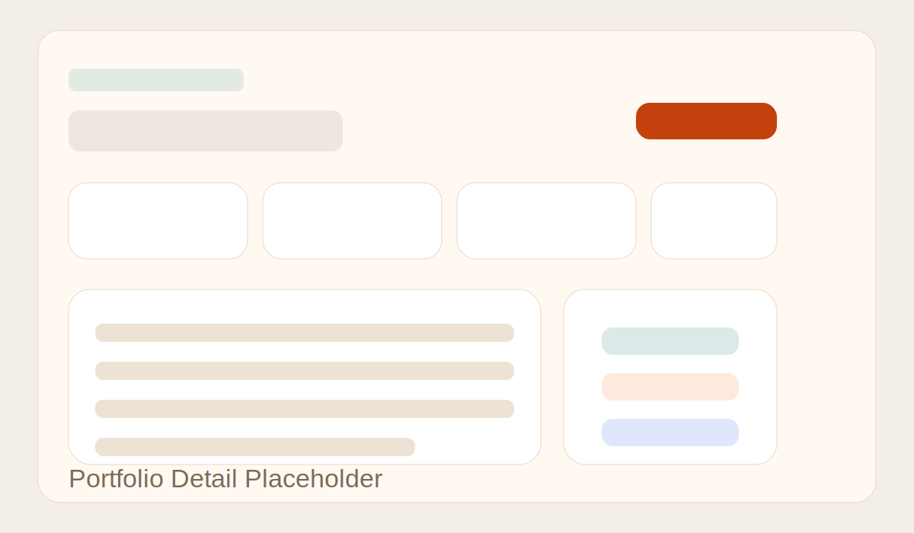

<div align="center">

# Polito

### Django Portfolio Management System

A polished portfolio tracking app built with Django for managing portfolios, holdings, and transactions in a secure user-based dashboard.

<p>
  
  
  
  
  
</p>

<p>
  <a href="#features">Features</a> •
  <a href="#screenshots">Screenshots</a> •
  <a href="#tech-stack">Tech Stack</a> •
  <a href="#quick-start">Quick Start</a> •
  <a href="#routes">Routes</a> •
  <a href="#project-structure">Structure</a>
</p>

</div>

---

## Overview

Polito is a Django-based portfolio management platform designed for learning, showcasing, and extending into a more complete financial product.

It lets each authenticated user manage their own:

- portfolios
- holdings
- transactions
- dashboard analytics

This makes it a strong GitHub project because it demonstrates:

- authentication and authorization
- relational data modeling
- analytics and chart rendering
- CRUD-style workflows
- test coverage and project structure

## Features

<table>
  <tr>
    <td width="50%">
      <h3>Authentication</h3>
      <ul>
        <li>Sign up, log in, and log out</li>
        <li>Protected pages with Django auth</li>
        <li>User-specific data isolation</li>
      </ul>
    </td>
    <td width="50%">
      <h3>Portfolio Management</h3>
      <ul>
        <li>Create multiple portfolios</li>
        <li>Edit and remove portfolios safely</li>
        <li>Track cash balance and target return</li>
        <li>View portfolio-level summaries</li>
      </ul>
    </td>
  </tr>
  <tr>
    <td>
      <h3>Asset Tracking</h3>
      <ul>
        <li>Add stocks, ETFs, crypto, bonds, and cash</li>
        <li>Update live positions as holdings change</li>
        <li>Track quantity, average cost, and market price</li>
        <li>Compute value and unrealized P/L</li>
      </ul>
    </td>
    <td>
      <h3>Transactions</h3>
      <ul>
        <li>Record buys, sells, dividends, and deposits</li>
        <li>Automatically update holdings and cash balances</li>
        <li>Link activity to portfolios and assets</li>
        <li>Review recent activity from the dashboard and full history page</li>
      </ul>
    </td>
  </tr>
</table>

## Screenshots

> Replace these placeholders with real screenshots after pushing the project.

<table>
  <tr>
    <td align="center">
      
      <br>
      <sub>Dashboard overview</sub>
    </td>
    <td align="center">
      
      <br>
      <sub>Portfolio detail</sub>
    </td>
  </tr>
</table>

## Demo

You can also add a short GIF here later:

```text
docs/images/polito-demo.gif
```

Example section after recording a demo:

```md
## Demo


```

## Tech Stack

| Layer | Tools |
| --- | --- |
| Backend | Python, Django 4.2 |
| Database | SQLite for local development |
| Frontend | HTML, Bootstrap 5, custom CSS |
| Charts | Chart.js |
| Authentication | Django authentication system |
| Testing | Django test framework |

## Quick Start

### 1) Clone the project

```bash
git clone <your-repo-url>
cd polito
```

### 2) Create a virtual environment

```bash
python -m venv .venv
```

### 3) Activate it

macOS / Linux:

```bash
source .venv/bin/activate
```

Windows:

```bash
.venv\Scripts\activate
```

### 4) Install dependencies

```bash
pip install -r requirements.txt
```

### 5) Apply migrations

```bash
python manage.py migrate
```

### 6) Create a superuser

```bash
python manage.py createsuperuser
```

### 7) Run the development server

```bash
python manage.py runserver
```

Then open:

```text
http://127.0.0.1:8000/
```

## Routes

| Route | Purpose |
| --- | --- |
| `/` | Redirects to login or dashboard |
| `/signup/` | Create an account |
| `/login/` | Sign in |
| `/dashboard/` | Main dashboard |
| `/transactions/` | Full transaction history |
| `/portfolios/` | Portfolio list |
| `/portfolios/create/` | Create a portfolio |
| `/portfolios/<id>/` | Portfolio detail |
| `/portfolios/<id>/edit/` | Update a portfolio |
| `/portfolios/<id>/delete/` | Delete a portfolio |
| `/assets/create/` | Add an asset |
| `/assets/<id>/edit/` | Update an asset position |
| `/transactions/create/` | Log a transaction |
| `/admin/` | Django admin |

## Data Model

### Portfolio
A user-owned investment account or strategy bucket.

**Fields**
- `owner`
- `name`
- `description`
- `cash_balance`
- `target_return`
- `created_at`
- `updated_at`

**Computed values**
- `invested_amount`
- `holdings_value`
- `total_value`
- `unrealized_profit`

### Asset
A holding inside a portfolio.

**Fields**
- `portfolio`
- `symbol`
- `name`
- `asset_type`
- `quantity`
- `average_cost`
- `current_price`
- `updated_at`

**Computed values**
- `cost_basis`
- `market_value`
- `pnl`
- `pnl_percent`

### Transaction
A trading or cash-flow event.

**Fields**
- `portfolio`
- `asset`
- `transaction_type`
- `quantity`
- `price_per_unit`
- `notes`
- `executed_at`
- `created_at`

**Computed value**
- `total_amount`

## Project Structure

```text
polito/
├── config/                  # Project settings and root URLs
├── portfolio/               # Core app: models, views, forms, tests, admin
├── portfolio/migrations/    # Database migrations
├── static/                  # CSS and local vendor assets
├── templates/               # Shared, portfolio, and auth templates
├── manage.py
├── requirements.txt
└── README.md
```

## Running Tests

```bash
python manage.py test
```

Current automated tests cover:

- portfolio value calculations
- asset profit calculations
- transaction application to cash and holdings
- transaction validation for oversells
- authentication protection on dashboard views
- ownership isolation between users
- authenticated portfolio creation, editing, and activity views

## GitHub Presentation Tips

To make this repository look even better on GitHub, add:

- real screenshots inside `docs/images/`
- one short demo GIF
- a deployed demo URL if you host it later
- a `LICENSE` file if you want the badge and license section to be fully accurate

## Roadmap

- REST API with Django REST Framework
- historical performance snapshots
- real market price integration
- PostgreSQL production setup
- Celery jobs for background updates

## License

This project is available under the MIT License.

---

<div align="center">
  Built with Django for learning, showcasing, and growing into a real product.
</div>
